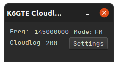
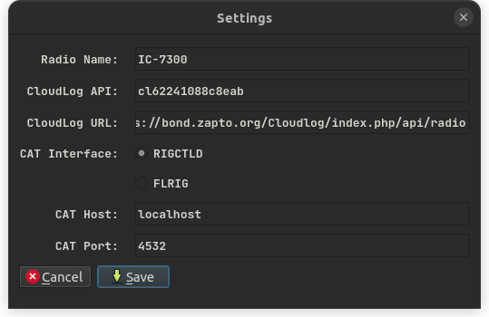

# CloudLogPyCAT

      

Python client to query the [flrig's](http://w1hkj.com/files/flrig/) XmlRPC interface and report radio frequency/mode to CloudLog

Written in Python3, using QT5. Either run from source, or if your running Linux, download the binary [here](https://github.com/mbridak/CloudLogPyCAT/releases/download/21.5.14/CloudLogPyCAT)

## Changes since release 21.5.14 Clumpy Litter

I ditched using the rigctld daemon supplied by hamlib tools. Instead I'll be using the [flrig's](http://w1hkj.com/files/flrig/) XmlRPC interface. It's way simpler. It's available on all platforms.

For Debian based Linux or Raspberry OS you can:

`sudo apt install flrig`

## Running from source

Install Python 3, then two required libraries.

If you're the Ubuntu/Debian type you can:

`sudo apt install python3-pyqt5 python3-requests`

You can install libraries via pip:

`python3 -m pip3 install -r requirements.txt`

Just make tuner.py executable and run it within the same folder, or type:

`python3 CloudLogPyCAT.py`

## Building a binary executable

I've included a .spec file in case you wished to create your own binary from the source. To use it, first install pyinstaller.

`python3 -m pip3 install pyinstaller`

Then build the binary.

`pyinstaller -F CloudLogPyCAT.spec`

Look in the newly created dist directory to find your binary.

## First run

When run for the first time click the settings button and edit the needed bits.

Then be sure to select your radio under the station tab while on the QSO screen for the updated band/mode data to show.

I've updated the desktop icon to be 3d animated. When you try and click on it to launch the program, the cat will bat the mouse away with it's paws.

That last part was BS. Just checking to see if you were paying attention.

